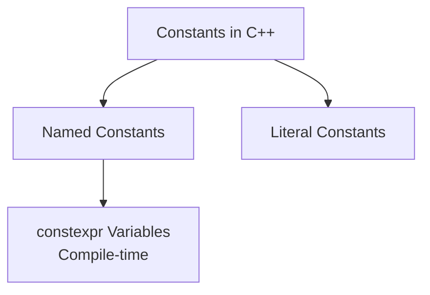
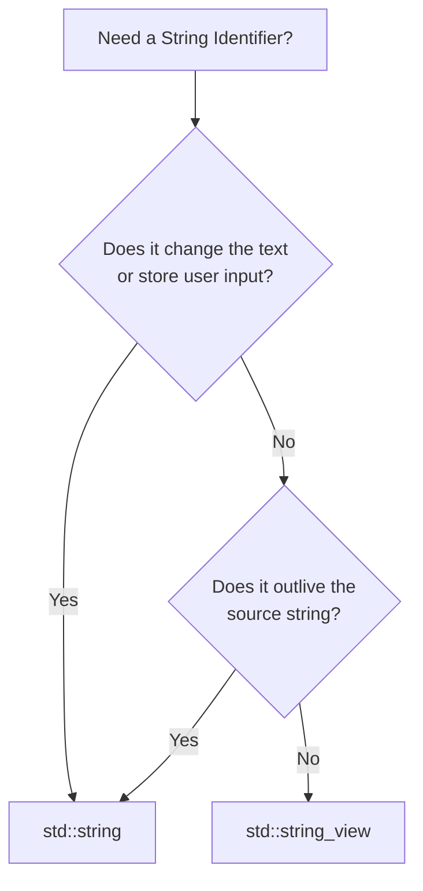

Markdown
# C++ Constants, Literals & Strings

A quick reference for memory constants, numeral systems, and string management in C++.

---

## 1. Constants & Compile-Time Evaluation

C++ utilizes constants to represent values that cannot be modified during program execution.



### `const` vs. `constexpr` Variables
* **`const`:** Promises that a variable's value cannot change *after initialization*. The initial value can be known at compile-time or resolved at runtime.
* **`constexpr`:** Explicitly promises that the variable is a **compile-time constant**. Its initializer *must* be a constant expression.
* **Best Practice:** Use `constexpr` for any constant whose value is known at compile-time. Use `const` only for runtime constants.

---

## 2. Literal Constants & Suffixes

Literals are fixed values typed directly into the source code.

| Literal Type | Default Type | Suffix Example | Target Type |
| :--- | :--- | :--- | :--- |
| **Integer** | `int` | `5L` / `5U` | `long` / `unsigned int` |
| **Floating Point** | `double` | `5.0f` | `float` |
| **String** | C-style array | `"Hello"s` | `std::string` |

> ⚠️ **Magic Numbers:** Avoid using un-named raw literals (e.g., `setMax(30);`). Replace them with named `constexpr` variables.

---

## 3. Alternative Numeral Systems

* **Hexadecimal:** Prefixed with `0x`.
* **Binary:** Prefixed with `0b`.
* **Digit Separators:** Use `'` for readability (e.g., `0b1100'0101`).

```cpp
#include <bitset>
// Print binary representation of hexadecimal 0xC5
std::cout << std::bitset<8>{ 0xC5 }; // Outputs: 11000101
```

---

## 4. Strings: Owners vs. Viewers

### `std::string` (The Owner)
* Manages its own dynamic memory.
* Copying is computationally expensive.
* **Rule:** Do not pass `std::string` by value to function parameters.

### `std::string_view` (The Viewer)
* Lightweight, inexpensive wrapper (pointer + length).
* Read-only access without copying.
* **Dangling Warning:** If the source string is destroyed, the view becomes invalid.


