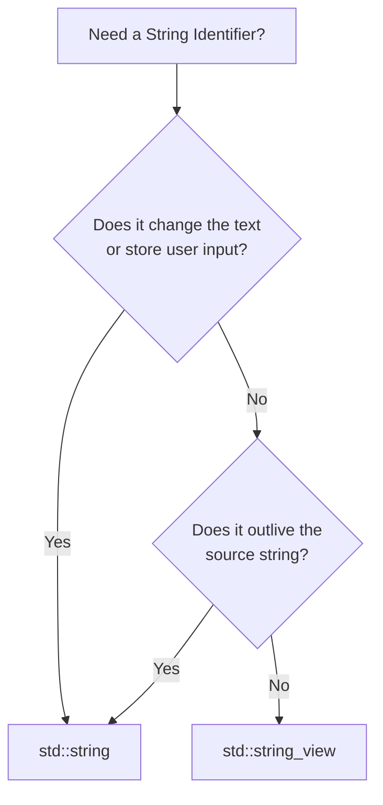

# C++ Constants, Literals & Strings

A quick reference for memory constants, numeral systems, and string management in C++.

---

## 1. Constants & Compile-Time Evaluation

C++ utilizes constants to represent values that cannot be modified during program execution.

```mermaid
graph TD
    A[Constants in C++] --> B[Named Constants]
    A --> C[Literal Constants]
    B --> D[constexpr Variables <br>Compile-time]
### `const` vs. `constexpr` Variables
* **`const`:** Promises that a variable's value cannot change *after initialization*. The initial value can be known at compile-time or resolved at runtime (e.g., from user input).
* **`constexpr`:** Explicitly promises that the variable is a **compile-time constant**. Its initializer *must* be a constant expression.
* *Best Practice:* Use `constexpr` for any constant whose value is known at compile-time. Use `const` only for runtime constants.

### Compile-Time Optimization Techniques
Modern optimizing compilers shift resource-heavy computations from runtime to compile-time using the **As-If Rule** (the compiler can alter underlying instructions as long as the observable output remains identical).
* **Constant Folding:** Replacing an expression containing constant operands with its computed result (e.g., `3 + 4` becomes `7` in the binary).
* **Constant Propagation:** Replacing a variable identifier with its known constant value to eliminate unnecessary memory fetch operations.
* **Dead Code Elimination:** Removing variables or expressions that are calculated but never affect the program's observable behavior.

---

## 2. Literal Constants & Suffixes

Literals are fixed values typed directly into the source code. Every literal has a deduced type. If the default type is insufficient, append a specific suffix.

| Literal Type | Default Type | Suffix Example | Target Type |
| :--- | :--- | :--- | :--- |
| **Integer** | `int` | `5L` / `5U` | `long` / `unsigned int` |
| **Floating Point** | `double` | `5.0f` | `float` (Prevents precision warnings) |
| **String** | C-style array | `"Hello"s` | `std::string` (Requires `using namespace std::string_literals;`) |
| **String View** | C-style array | `"Hello"sv` | `std::string_view` (Requires `using namespace std::string_view_literals;`) |

> ⚠️ **Magic Numbers:** Avoid using un-named raw literals (e.g., `setMax(30);`) inside your logic. Replace them with named `constexpr` variables to provide meaningful context and a single point of updates.

---

## 3. Alternative Numeral Systems

C++ interprets numbers as base-10 decimal by default, but supports alternative representations using specific literal prefixes.

* **Hexadecimal (Base 16):** Prefixed with `0x` (e.g., `0xF` is decimal 15). Crucial for mapping binary configurations concisely, as one hex digit represents exactly 4 bits.
* **Binary (Base 2):** Prefixed with `0b` (e.g., `0b1010` is decimal 10).
* **Octal (Base 8):** Prefixed with a leading `0` (e.g., `012` is decimal 10). *Avoid octal literals entirely, as they are easily confused with standard decimals.*
* **Digit Separators:** Use single quotes (`'`) as a visual separator for long numbers (e.g., `2'132'673'462` or `0b1100'0101`).

### Printing Alternative Systems
Use the stream manipulators `std::hex` or `std::oct` to change the layout state of `std::cout`. To print binary text representations, use `std::bitset<bits>` from `<bitset>`:
```cpp
#include <bitset>
std::cout << std::bitset<8>{ 0xC5 }; // Outputs: 11000101
```

---

## 4. Strings: Owners vs. Viewers

Managing text processing efficiently requires identifying the distinction between string data ownership and read-only viewing boundaries.

### `std::string` (The Owner)
* Manages its own dynamic block of memory at runtime.
* Safely copies data from its initializer so it can outlive it, making initialization and copying **computationally expensive**.
* *Crucial Rule:* **Do not pass `std::string` by value** to function parameters, as this forces a slow duplication of the text sequence.

### `std::string_view` (The Viewer)
* A lightweight, inexpensive wrapper containing a pointer to an existing sequence of characters and a length tracker.
* Provides **read-only access** without duplicating text data. Fully compatible with compile-time `constexpr` declarations.
* **Dangling Views (Undefined Behavior):** Because it does not own the characters, a `std::string_view` will break if its underlying data source is modified or destroyed.

```cpp
// ⚠️ DANGLING VIEW EXAMPLE (CRASH RISK)
std::string_view getDangling() {
    std::string local{"Alex"};
    return local; // ❌ local is destroyed here; returns a broken view
}

// ✅ SAFE VIEW EXAMPLE
std::string_view getSafe() {
    return "Alex"; // ✅ OK: C-style string literals exist for the entire program duration
}
```

### Summary Choice Tree



### I/O Integration Checklist
* **`std::cin >> name;`** stops extracting characters at the first whitespace character it hits.
* Use **`std::getline(std::cin >> std::ws, variable);`** to capture a full line of text safely. The `std::ws` input manipulator is critical here—it drops any trailing newlines (`\n`) left behind in the I/O buffer by previous extractions so they do not falsely skip your string reading sequence.
